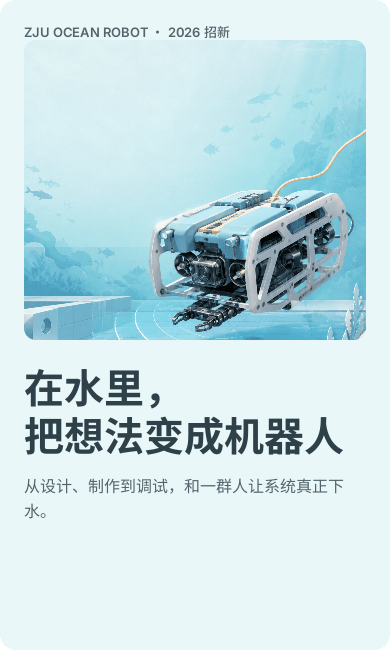

# Tweet Creation / Organization WeChat Studio

一套可迁移到不同组织和公众号的 Codex + Ardot 工作流。它把可编辑视觉组件、每个组织的品牌资料、单篇文章事实和最终微信投递适配分开管理。

不是“换 Logo 和颜色”的统一模板。新公众号会先建立组织包，再按该组织的受众、语气、视觉母题、文章类型和真实资料生成文章与文件资产。

## Ardot 效果样稿

当前保留 Ocean 招新作为组件、构图、留白和手机阅读节奏的基准样稿：



## 能力

- 新组织调研与组织包初始化。
- 语气、品牌色、视觉路线、文章类型与事实来源建模。
- 按公众号与文章类型生成资产计划。
- 封面背景、章节视觉、透明插画、技术解释图与照片派生资产的生成和注册。
- Ardot 语义变量模式、原生组件、390 px 长文画板和分段视觉 QA。
- 由文章 JSON 生成可执行的 Ardot 装配清单。
- 16 类语义区块与隐藏的微信内联 HTML 投递适配。
- 事实来源、占位符、图片、Logo、二维码和微信安全格式校验。
- 默认只生成草稿交付物，正式发布需要单独确认。

## 快速开始

列出已有组织包：

```bash
python3 scripts/orgs.py list
```

初始化新公众号：

```bash
python3 scripts/orgs.py init new-account-id \
  --name "新组织或公众号名称" \
  --root organizations
```

生成资产计划：

```bash
python3 scripts/orgs.py asset-plan \
  organizations/new-account-id recruitment \
  --output output/new-account-id/recruitment-asset-plan.json
```

生成 Ardot 装配清单：

```bash
python3 scripts/build_ardot_manifest.py article.json \
  --org organizations/new-account-id \
  --output output/new-account-id/article-slug/ardot-manifest.json
```

按清单在 Ardot 中完成原生组件装配、截图检查和视觉确认后，才生成微信投递文件：

```bash
python3 scripts/compile_wechat.py article.json \
  --org organizations/new-account-id \
  --output output/new-account-id/article-slug \
  --check
```

详细的调研、迁移、资产生成、素材注册与投递流程见 [使用说明](references/%E4%BD%BF%E7%94%A8%E8%AF%B4%E6%98%8E.md)。

## 目录

```text
├── SKILL.md
├── README.md
├── agents/
├── references/
├── scripts/
├── organizations/
├── examples/
└── tests/
```

`organizations/` 内包含浙江大学海洋机器人协会迁移样本。状态为 `migrated-draft`，代表需组织审核后才能转为正式品牌包。其他公众号应通过调研新增独立组织包与 Ardot 品牌模式。

当前共享 Ardot 组件系统与 Ocean 效果样稿：
[Org WeChat Studio｜公众号组件系统](https://ardot.tencent.com/file/718644779257522)

`article.json` 是内容源，Ardot 是视觉源；`wechat.html` 只是最终传输文件。

## 安全边界

- Logo 和二维码只能来自用户或官方资料。
- 生成图像不能冒充真实人物、活动或项目成果。
- 组织包不存储 AppSecret、access token 或其他账号凭据。
- 正式发布始终需要一次独立确认。

## 验证

```bash
python3 -m unittest discover -s tests -v
python3 /path/to/skill-creator/scripts/quick_validate.py .
```
