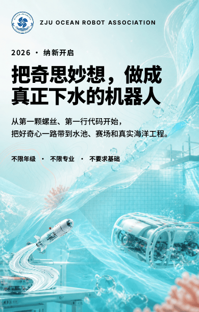

# Tweet Creation / Organization WeChat Studio

一套可迁移到不同组织和公众号的 Codex + Ardot 工作流。它把可编辑视觉组件、每个组织的品牌资料、单篇文章事实和最终微信投递适配分开管理。

不是“换 Logo 和颜色”的统一模板。新公众号会先建立组织包，再按该组织的受众、语气、视觉母题、文章类型和真实资料生成文章与文件资产。

## Ardot 效果样稿

当前保留用户实际认可的 Ocean「灵动丰富版」作为构图方法、留白和手机阅读节奏的基准：



[Ardot 基准文件｜招新推文·灵动丰富版 2026](https://ardot.tencent.com/file/718358960022995)（文章根节点 `51:2`）。这是 Ocean 的效果基准，不是让其他组织照抄海洋风格。

最新的独立组织实战是[拓浙 AI 生态 2026 秋季招新｜Source Zero](examples/tuozhe-2026-autumn-recruitment-sourcezero/README.md)：它只从原始文案、活动方案、演讲稿和现场照片重新建立组织包，先生成同一家族连续底图与四枚文章专属透明组件，再以开放轨迹和错位照片完成高密度排版。[全新 Ardot 源文件](https://ardot.tencent.com/file/719086033843150?node_id=8%3A23)的文章根节点为 `8:23`，校准板为 `8:13`，专属组件源为 `8:18`。

## 能力

- 新组织调研与组织包初始化。
- 全文前先做 2–3 组 Ardot 小样校准，未批准路线不得开始整篇。
- 先写 4–10 章叙事分镜，再选组件和生图，避免 block 直接变卡片。
- 语气、品牌色、视觉路线、文章类型与事实来源建模。
- 按公众号与文章类型生成资产计划。
- 排版前强制生成文章专属的浮动插图、章节转场、行内解释图和收尾视觉，并先做成 Ardot 小组件。
- 封面背景、章节视觉、透明/开放边缘插画、技术解释图与照片派生资产的生成和注册。
- AI 底图按“一个母版 + 1–3 个同系列变体”校准，章节只改变裁切、透明度和局部构图，不随机换风格。
- Ardot 语义变量模式、原生组件、390 px 长文画板和分段视觉 QA。
- 由文章 JSON 生成可执行的 Ardot 装配清单。
- 默认开放式构图；闭合方框不超过正文区块的 20%、不连续，并至少保留三处不对称或越界视觉。
- 默认 `compact-editorial` 信息密度：15–17 px 正文、1.45–1.62 行高、轻微负字距、8–14 px 段距，并校验内容占用率与最大无意空洞。
- 16 类语义区块与隐藏的微信内联 HTML 投递适配。
- 事实来源、占位符、图片、Logo、二维码和微信安全格式校验。
- 默认只生成草稿交付物，正式发布需要单独确认。

## 快速开始

列出已有组织包：

```bash
python3 scripts/orgs.py list
```

初始化新公众号：

```bash
python3 scripts/orgs.py init new-account-id \
  --name "新组织或公众号名称" \
  --root organizations
```

先生成组织视觉校准方向（只做小样，不做全文）：

```bash
python3 scripts/build_visual_directions.py \
  organizations/new-account-id recruitment \
  --output output/new-account-id/visual-directions.json
```

待用户批准 Ardot 小样并回写 `organization.visual.calibration` 后，生成资产计划与文章叙事分镜：

```bash
python3 scripts/orgs.py asset-plan \
  organizations/new-account-id recruitment \
  --output output/new-account-id/recruitment-asset-plan.json
```

```bash
python3 scripts/build_storyboard.py article.json \
  --output output/new-account-id/article-slug/storyboard-plan.json
```

为本篇文章生成小组件/小插图计划：

```bash
python3 scripts/build_visual_kit.py article.json \
  --org organizations/new-account-id \
  --output output/new-account-id/article-slug/visual-kit-plan.json
```

逐张生图、验图，每张都必须绑定正文原句、具体主体/动作、分镜章节和构图职责。只有 `ready_for_layout: true` 才生成 Ardot 装配清单：

```bash
python3 scripts/build_ardot_manifest.py article.json \
  --org organizations/new-account-id \
  --output output/new-account-id/article-slug/ardot-manifest.json
```

按分镜章节完成 Ardot 长文装配后，截取 Hero、章节、证据、复杂区块和 CTA 五类实际节点，建立独立验收文件：

```bash
python3 scripts/build_visual_review.py visual-review.json --article article.json
```

把路径写入 `article.visual_review_file`，通过后才生成微信投递文件：

```bash
python3 scripts/compile_wechat.py article.json \
  --org organizations/new-account-id \
  --output output/new-account-id/article-slug \
  --check
```

详细的调研、迁移、资产生成、素材注册与投递流程见 [使用说明](references/%E4%BD%BF%E7%94%A8%E8%AF%B4%E6%98%8E.md)。

## 目录

```text
├── SKILL.md
├── README.md
├── agents/
├── references/
├── scripts/
├── organizations/
├── examples/
└── tests/
```

`organizations/` 内包含浙江大学海洋机器人协会迁移样本和拓浙 AI 生态的已校准组织包。其他公众号应通过调研新增独立组织包与 Ardot 品牌模式。

共享的 [Org WeChat Studio 组件系统](https://ardot.tencent.com/file/718644779257522) 只用于语义基础和组织模式，不再作为效果基准。

`article.json` 是内容源，Ardot 是视觉源；`wechat.html` 只是最终传输文件。

## 安全边界

- Logo 和二维码只能来自用户或官方资料。
- 生成图像不能冒充真实人物、活动或项目成果。
- 组织包不存储 AppSecret、access token 或其他账号凭据。
- 正式发布始终需要一次独立确认。

## 验证

```bash
python3 -m unittest discover -s tests -v
python3 /path/to/skill-creator/scripts/quick_validate.py .
```
