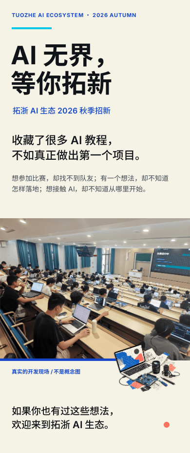
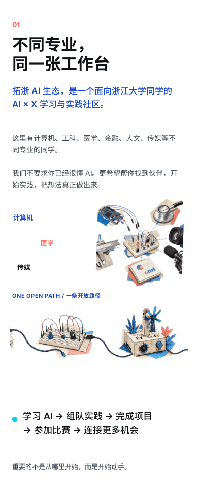
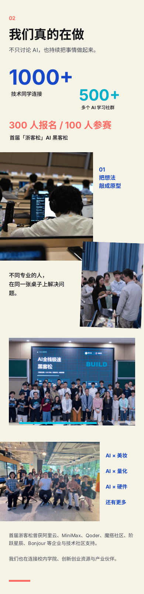
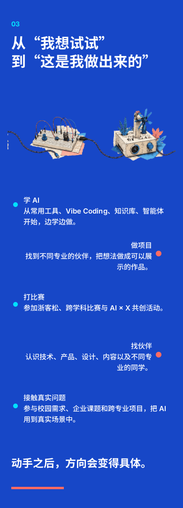
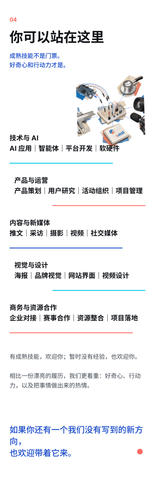
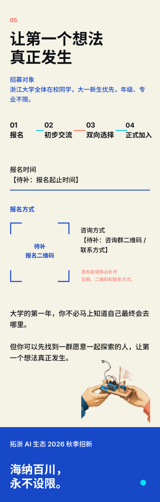

# 拓浙 AI 生态 2026 秋季招新｜开放工作台版

这是泛化工作流在第二个组织上的完整实战样本。版面没有复用 Ocean 的海洋风格，也没有套用紫色 AI 模板，而是从拓浙的真实浙客松照片、跨专业属性和“把想法做出来”的行动主张重新生成组织专属资产。

[打开 Ardot 可编辑源文件](https://ardot.tencent.com/file/719045826140352)（文章根节点 `3:10`；透明小组件库 `3:17`）。

## 最终分段预览

| 首屏 | 身份与路径 |
|---|---|
|  |  |

| 真实活动证据 | 可以做什么 |
|---|---|
|  |  |

| 岗位方向 | 报名与收束 |
|---|---|
|  |  |

## 资产与内容

- `article.json`：完整结构化文案，未提供的信息保留待补标记。
- `storyboard.json`：六章节叙事与构图职责。
- `visual-kit.json`：每个生成组件和真实照片的语义映射。
- `source-copy.txt`：用户提供 PDF 的抽取文字，供事实核对。
- `../../organizations/tuozhe-ai-ecosystem/`：拓浙独立组织包、照片、透明组件和 Ardot 映射。

## 发布前仍需补齐

- 报名起止时间。
- 报名二维码。
- 咨询群二维码或联系方式。

这些信息没有从上下文推断，补齐前本稿只作为视觉与文案草稿。
